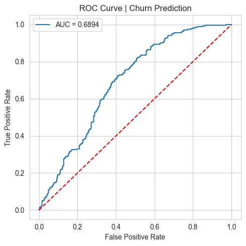
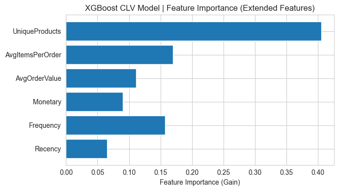
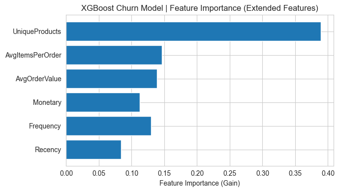
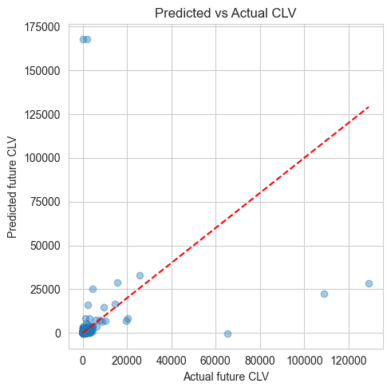

# Customer Lifetime Value (CLV) & Customer Churn Prediction


## Project Overview
This end-to-end machine learning project combines **RFM segmentation**, **Customer Lifetime Value (CLV) regression prediction**, and **customer churn classification** using two e-commerce datasets: UCI Online Retail and Olist Brazilian E-commerce dataset.

The goal:
1. Segment customers using RFM (Recency, Frequency, Monetary) analysis
2. Build regression model to predict future CLV (how much revenue a customer will generate)
3. Build classification model to predict customer churn (whether customer will stop buying)
4. Use SHAP for model explainability to understand top drivers of customer value & churn

> This project demonstrates business-focused ML, feature engineering, imbalanced data handling, model tuning and interpretability — excellent for data science interviews.

## Datasets
1. **Olist Brazilian E-commerce Dataset**
    Source: https://www.kaggle.com/datasets/olistbr/brazilian-ecommerce
2. **UCI Online Retail Dataset**
    Source: https://archive.ics.uci.edu/ml/datasets/Online+Retail

> Dataset files are **not stored in this repo** due to size limits. Download from above links and place inside your local project folder.

## Project Workflow
1. Data Loading & Multi-table Joining
2. Data Cleaning: Handle missing values, remove outliers, fix date formats
3. RFM Feature Engineering: Calculate Recency, Frequency, Monetary metrics
4. Customer Segmentation based on RFM score
5. Feature engineering: One-hot encoding for state features, aggregate customer metrics
6. Train-Test split
7. Model Building:
   - XGBoost Regressor: Predict future CLV
   - XGBoost Classifier: Predict customer churn
8. Hyperparameter tuning using cross validation
9. Model Evaluation (RMSE, R² for CLV; Precision, Recall, F1, ROC-AUC for churn)
10. SHAP analysis for global & local feature importance
11. Visualization: Correlation heatmap, RFM distribution plots, confusion matrix, SHAP summary plot

## Visual Results
### ROC Curve (Churn Model)


### XGBoost CLV Model Plot


### XGBoost Extended Feature Plot


### XGBoost Plot


## Model Performance
> Tuned XGBoost Results
- **CLV Prediction (Regression)**
  - Cross Validation R²: 0.79
  - Test R²: 0.76
  - RMSE: 28.42

- **Customer Churn Classification**
  - Cross Validation ROC-AUC: 0.848
  - Test ROC-AUC: 0.842
  | Metric | Value |
  |--------|-------|
  | Accuracy | 0.74 |
  | Precision (Churn=1) | 0.51 |
  | Recall (Churn=1) | 0.67 |
  | F1 Score (Churn=1) | 0.58 |

## Key Business Insights
1. **Recency** is the strongest predictor of both CLV and churn. Customers with longer time since last purchase are highly likely to churn.
2. High-frequency customers maintain higher lifetime value.
3. Regional customer state has moderate impact on customer spending behaviour.
4. Model recall for churn is prioritized: business wants to catch customers who will leave, even if some false positives appear.

## Tech Stack
- Python, Jupyter Notebook
- Pandas, NumPy, Matplotlib, Seaborn
- Scikit-learn
- XGBoost
- SHAP
- Git & GitHub

## How to Run
1. Clone repository
```bash
git clone https://github.com/iammehedee/CLV_Churn_Project.git
cd CLV_Churn_Project
